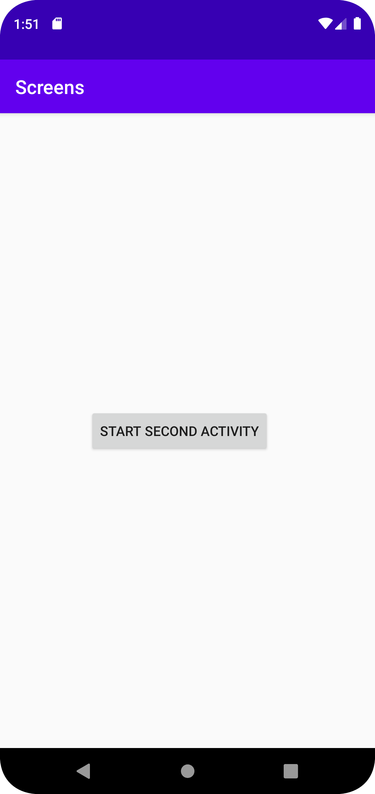
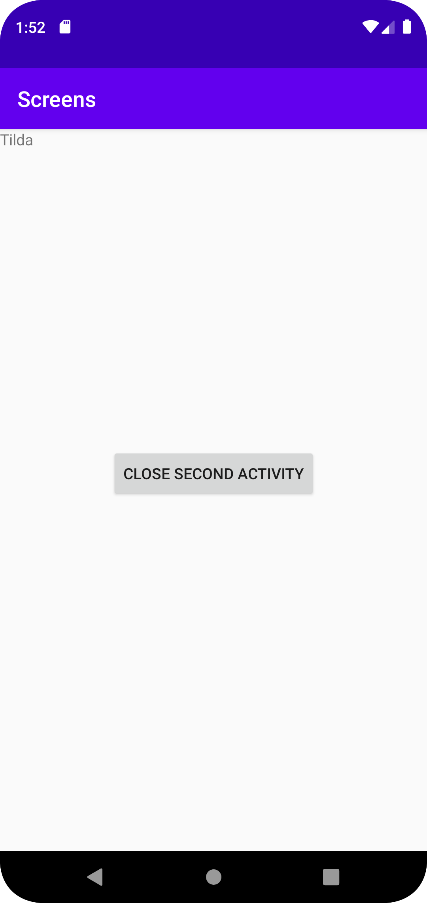

# Rapport

I denna uppgift har ytterligare en activity skapats. Den har fått namnet "second_activity" och möjliggör att information kan skickas mellan de två olika aktiviteterna. Intent har används tillsammans med bundle och extras.

```
 button.setOnClickListener(new View.OnClickListener() {
            @Override
            public void onClick(View view) {
                Intent intent = new Intent(MainActivity.this, SecondActivity.class);
                intent.putExtra("name", "Tilda");
                startActivity(intent);

            }
        });
```

I koden ska id name bli funnen i TextView. Tack vare "extras.getString" skrivs namnet ut. Nedan kan koden läsas:

```
TextView textView = findViewById(R.id.name);


        Bundle extras = getIntent().getExtras();
        if (extras != null) {
            String name = extras.getString("name");
            textView.setText(name);

        }

        Button close = findViewById(R.id.close_second_activity);
        close.setOnClickListener(new View.OnClickListener() {

            @Override
            public void onClick(View view) {
                finish();
            }

        });
```

Bilder läggs i samma mapp som markdown-filen.


